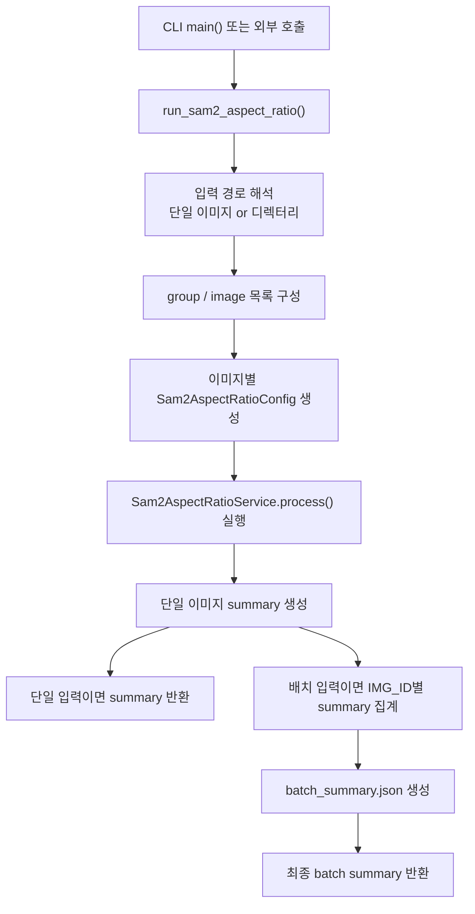
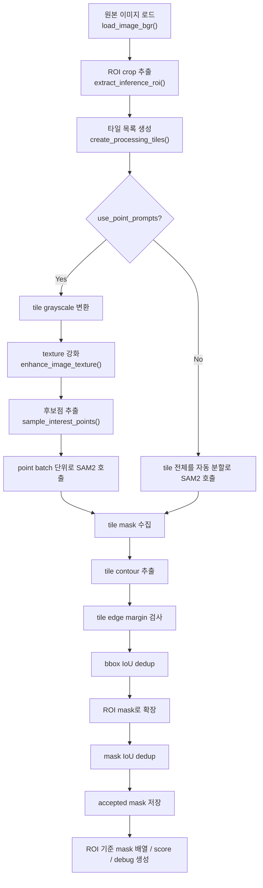
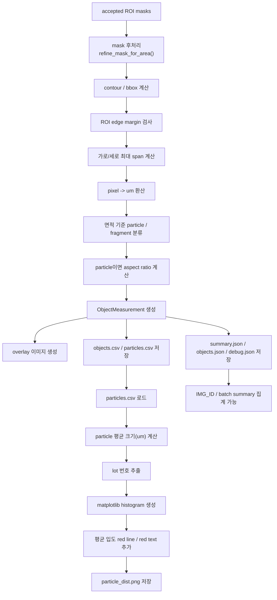

# `precursor_aspect_ratio_SAM2.py` 설명서

## 개요

`precursor_aspect_ratio_SAM2.py`는 `Ultralytics SAM2`를 이용해 이미지 또는 이미지 디렉터리에서 객체를 분할하고, 각 객체를 `particle`(정상 입자) 또는 `fragment`(미분 입자)로 분류한 뒤, 입자의 종횡비와 입도 분포를 계산하는 스크립트다.

주요 기능은 다음과 같다.

- 입력 이미지 또는 디렉터리 순회
- ROI 지정 후 타일 단위 SAM2 추론
- 필요 시 OpenCV 후보점 기반 point prompt 추론
- 객체별 면적 측정 및 `particle` / `fragment` 분류
- `particle`의 가로/세로 대표 길이와 종횡비 계산
- pixel / micrometer 단위 길이 저장
- `summary.json`, `objects.csv`, `particles.csv`, `particle_dist.png` 저장
- 디렉터리 입력 시 `IMG_ID` 단위 및 전체 batch 요약 생성

---

## 1. 실행 진입점

실제 메인 실행 함수는 아래다.

```python
run_sam2_aspect_ratio(...)
```

CLI에서는 `main()`이 argument를 파싱한 뒤 `run_sam2_aspect_ratio()`를 호출한다.

---

## 2. 파라미터 설명

아래 표는 `run_sam2_aspect_ratio()`와 CLI에서 실제로 사용하는 모든 주요 파라미터를 기준으로 정리했다.

### 2.1 입력 / 출력 / 모델 경로

| Python Parameter | CLI Flag | Type | Default | 설명 |
|---|---|---:|---|---|
| `str_input` | `--input` | `str` | `img/5000_test_1.jpg` | 단일 이미지 경로 또는 디렉터리 경로. 디렉터리면 `IMAGE_ROOT_DIR/{IMG_ID}/*` 구조를 순회한다. |
| `str_outputDir` | `--output_dir` | `str` | `out_sam2_aspect_ratio_YYYYMMDD_HHMMSS` | 결과 저장 폴더. 기본값은 실행 시각이 붙은 새 폴더다. |
| `str_modelConfig` | `--model_cfg` | `str` | `model/sam2.1_hiera_t.yaml` | SAM2 설정 파일 경로. 메타데이터 기록용으로도 사용된다. |
| `str_modelWeights` | `--model` | `str` | `model/sam2.1_hiera_base_plus.pt` | SAM2 가중치 파일 경로. 내부적으로 Ultralytics가 인식 가능한 alias 이름으로 정규화될 수 있다. |

### 2.2 ROI 관련

| Python Parameter | CLI Flag | Type | Default | 설명 |
|---|---|---:|---|---|
| `int_roiXMin` | `--roi_x_min` | `int` | `0` | ROI 시작 x 좌표 |
| `int_roiYMin` | `--roi_y_min` | `int` | `0` | ROI 시작 y 좌표 |
| `int_roiXMax` | `--roi_x_max` | `int` | `1024` | ROI 끝 x 좌표 |
| `int_roiYMax` | `--roi_y_max` | `int` | `768` | ROI 끝 y 좌표 |
| `int_bboxEdgeMargin` | `--bbox_edge_margin` | `int` | `8` | ROI 경계에 너무 가까운 bbox를 제외하기 위한 margin |
| `int_tileEdgeMargin` | `--tile_edge_margin` | `int` | `8` | tile 경계에 너무 가까운 bbox를 제외하기 위한 margin |

설명:

- 실제 추론은 원본 전체 이미지가 아니라 먼저 ROI를 잘라낸 뒤 진행한다.
- ROI가 원본보다 크면 이미지 크기에 맞게 자동으로 clamp된다.
- ROI 가장자리에 걸친 객체와 tile seam 근처 객체를 제거하기 위해 `bbox_edge_margin`, `tile_edge_margin`이 따로 존재한다.

### 2.3 분류 / 면적 / 마스크 후처리

| Python Parameter | CLI Flag | Type | Default | 설명 |
|---|---|---:|---|---|
| `float_particleAreaThreshold` | `--area_threshold` | `float` | `1500.0` | 이 면적 이상이면 `particle`, 미만이면 `fragment`로 분류 |
| `float_maskBinarizeThreshold` | `--mask_binarize_threshold` | `float` | `0.0` | SAM2 raw mask를 binary mask로 바꾸는 threshold |
| `int_minValidMaskArea` | `--min_valid_mask_area` | `int` | `1` | 이 값보다 작은 mask는 무시 |
| `int_maskMorphKernelSize` | `--mask_morph_kernel_size` | `int` | `0` | morphology kernel 크기. `0` 또는 `1`이면 morphology 비활성화 |
| `int_maskMorphOpenIterations` | `--mask_morph_open_iterations` | `int` | `0` | morphology open 반복 횟수 |
| `int_maskMorphCloseIterations` | `--mask_morph_close_iterations` | `int` | `0` | morphology close 반복 횟수 |

설명:

- `mask area`는 분류와 통계에 직접 영향을 주는 핵심 값이다.
- morphology를 켜면 최종 면적과 contour shape이 바뀔 수 있다.
- `particle`과 `fragment`는 현재 클래스 이름일 뿐이며, 내부적으로는 면적 기반 rule-based 분류다.

### 2.4 SAM2 추론 / 타일링 / 후보점

| Python Parameter | CLI Flag | Type | Default | 설명 |
|---|---|---:|---|---|
| `int_imgSize` | `--imgsz` | `int` | `1536` | SAM2 추론에 전달하는 입력 크기 |
| `int_tileSize` | `--tile_size` | `int` | `512` | ROI를 나누는 tile 크기 |
| `int_stride` | `--stride` | `int` | `256` | tile 간 stride |
| `int_pointsPerTile` | `--points_per_tile` | `int` | `80` | point prompt 모드에서 tile당 후보점 최대 개수 |
| `int_pointMinDistance` | `--point_min_distance` | `int` | `14` | 후보점 간 최소 거리 |
| `float_pointQualityLevel` | `--point_quality_level` | `float` | `0.03` | `goodFeaturesToTrack` quality level |
| `int_pointBatchSize` | `--point_batch_size` | `int` | `32` | 한 번의 SAM2 호출에 묶어서 넣는 point 수 |
| `float_dedupIou` | `--dedup_iou` | `float` | `0.60` | mask IoU 기준 중복 제거 threshold |
| `float_bboxDedupIou` | `--bbox_dedup_iou` | `float` | `0.85` | bbox IoU 기준 1차 중복 제거 threshold |
| `bool_usePointPrompts` | `--use_point_prompts` / `--no-use_point_prompts` | `bool` | `True` | OpenCV 후보점 기반 point prompt 추론 사용 여부 |
| `bool_retinaMasks` | `--retina_masks` / `--no-retina_masks` | `bool` | `True` | SAM2 retina mask 사용 여부 |
| `str_device` | `--device` | `str \| None` | `None` | 추론 device. 예: `cpu`, `cuda:0` |

설명:

- `bool_usePointPrompts=True`이면 OpenCV로 후보점을 뽑아 tile마다 point prompt 추론을 수행한다.
- `False`이면 tile 전체에 대해 자동 mask 생성 방식으로 SAM2를 호출한다.
- tile 수가 많고 point 수가 많을수록 속도는 느려지지만 recall이 올라갈 수 있다.

### 2.5 길이 환산 / 입자 타입

| Python Parameter | CLI Flag | Type | Default | 설명 |
|---|---|---:|---|---|
| `bool_smallParticle` | `--small_particle` | `bool` | `False` | 길이 환산 스케일을 small particle 기준으로 변경 |

스케일 규칙:

- 기본 스케일: `276 pixel = 50 um`
- `--small_particle` 사용 시: `184 pixel = 10 um`

즉 이 플래그는 아래 항목 전체에 영향을 준다.

- `objects.csv`, `particles.csv`의 `Um` 컬럼
- `summary.json`의 `scale_pixels`, `scale_micrometers`, `micrometers_per_pixel`
- `particle_dist.png` histogram의 x축 값과 평균 입도

### 2.6 결과 저장

| Python Parameter | CLI Flag | Type | Default | 설명 |
|---|---|---:|---|---|
| `bool_saveIndividualMasks` | `--save_mask_imgs` / `--no-save_mask_imgs` | `bool` | `True` | `particle_masks`, `fragment_masks` 폴더에 개별 mask png 저장 여부 |

---

## 3. 주요 출력 파일

단일 이미지 출력 폴더에는 일반적으로 아래 파일들이 생성된다.

| 파일명 | 설명 |
|---|---|
| `01_input.png` | 원본 입력 이미지 |
| `02_input_roi.png` | 실제 추론에 사용된 ROI 이미지 |
| `03_overlay_roi.png` | ROI 위에 객체 마스크, bbox, 라벨을 그린 이미지 |
| `04_overlay_full.png` | 원본 전체 이미지 위에 ROI overlay를 덮은 이미지 |
| `objects.csv` | 모든 유효 객체의 측정 결과 |
| `particles.csv` | `particle`로 분류된 객체만 별도 저장한 CSV |
| `objects.json` | 객체 측정 결과 JSON |
| `summary.json` | 단일 이미지 요약 통계 |
| `debug.json` | tile, candidate point, accepted mask 등의 디버그 정보 |
| `particle_dist.png` | particle 입도 histogram |
| `particle_masks/` | 개별 particle mask png 폴더 |
| `fragment_masks/` | 개별 fragment mask png 폴더 |

배치 입력이면 추가로 아래가 생긴다.

| 파일명 | 설명 |
|---|---|
| `IMG_ID/img_id_summary.json` | 같은 `IMG_ID` 폴더 내 이미지들을 집계한 요약 |
| `batch_summary.json` | 전체 batch 요약 |

---

## 4. 측정값 의미

### 4.1 객체 분류

- `particle`: `int_maskArea >= float_particleAreaThreshold`
- `fragment`: `int_maskArea < float_particleAreaThreshold`

### 4.2 길이 측정

- `int_longestHorizontal`: mask 내부에서 가장 긴 가로 span(pixel)
- `int_longestVertical`: mask 내부에서 가장 긴 세로 span(pixel)
- 단, 실제 저장 전에는 `boundingRect width/height`를 넘지 않도록 clamp된다.

### 4.3 종횡비

`particle`에 대해서만 계산한다.

```text
aspect_ratio = min(horizontal, vertical) / max(horizontal, vertical)
```

즉 항상 `0 < aspect_ratio <= 1` 이다.

### 4.4 histogram 크기 정의

`particle_dist.png`에서 particle 하나의 크기는 아래로 정의한다.

```text
particle_size_um
= (float_longestHorizontalUm + float_longestVerticalUm) / 2
```

---

## 5. 메인 프로세스 Flowchart

복잡도가 높기 때문에 3개 파트로 나누어 설명한다.

### 5.1 전체 실행 흐름



### 5.2 이미지 1장에 대한 SAM2 추론 흐름



### 5.3 객체 측정, 통계, 그래프, 저장 흐름



---

## 6. 디렉터리 입력 구조

이 스크립트는 다음 두 형태를 지원한다.

### 6.1 단일 이미지

```text
img/5000_test_1.jpg
```

### 6.2 `IMG_ID` 폴더 구조

```text
IMAGE_ROOT_DIR/
  GC1234/
    image_000.png
    image_001.png
  GC5678/
    image_000.png
```

이 경우:

- `GC1234`, `GC5678`가 `IMG_ID`
- 각 `IMG_ID` 안의 이미지를 모두 처리
- 같은 `IMG_ID` 안의 이미지 summary를 평균내어 `img_id_summary.json` 생성
- 전체 `IMG_ID`를 다시 평균내어 `batch_summary.json` 생성

---

## 7. 처음 보는 사람이 빠르게 이해해야 할 핵심 포인트

1. 이 코드는 `ROI -> tile -> SAM2 -> mask filtering -> 측정 -> 통계 -> 저장` 구조다.
2. `particle / fragment`는 학습 기반 분류가 아니라 `면적 threshold` 기반 rule이다.
3. `use_point_prompts`를 켜면 OpenCV 후보점을 만든 뒤 SAM2를 prompt 방식으로 호출한다.
4. `small_particle`은 분류 기준이 아니라 길이 환산 스케일만 바꾼다.
5. `particle_dist.png`는 `particles.csv`를 다시 읽어서 만든 후처리 산출물이다.
6. batch 입력에서는 이미지 평균이 아니라 `IMG_ID 평균`이 최종 통계의 기본 단위다.

---

## 8. 권장 읽기 순서

이 파일을 처음 읽는다면 아래 순서가 가장 이해하기 쉽다.

1. `build_arg_parser()`
2. `run_sam2_aspect_ratio()`
3. `Sam2AspectRatioService.process()`
4. `predict_tiled_point_prompts()`
5. `measure_mask()`
6. `build_summary()` / `save_outputs()`
7. `build_img_id_summary()` / `build_batch_summary()`

