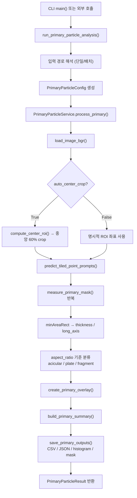

# `primary_particle_thickness_SAM2.py` 설명서

## 개요

`primary_particle_thickness_SAM2.py` 는 `precursur_aspect_ratio_SAM2.py` 를 cornerstone으로 하여,
2차전지 전구체 SEM 이미지(20,000배 / 50,000배)에서 **1차 입자** 를 segmentation하고
**침상(acicular) / 판상(plate)** 으로 분류하여 **두께(단축)** 를 측정하는 스크립트다.

기존 2차 입자 코드와의 핵심 차이점:

| 항목 | precursur_aspect_ratio_SAM2 | primary_particle_thickness_SAM2 |
|---|---|---|
| 분류 기준 | 면적 → particle / fragment | aspect_ratio + 면적 → acicular / plate / fragment |
| 두께 측정 | H/V span (축 방향) | `cv2.minAreaRect` 기반 단축 (회전 보정) |
| ROI 설정 | 수동 ROI 좌표 | **자동 중앙 crop** (또는 수동 ROI) |
| 타일/포인트 | tile=512, stride=256, pts=80 | tile=256, stride=128, pts=120 (더 촘촘) |
| 출력 CSV | objects.csv / particles.csv | objects.csv / **acicular.csv / plate.csv** |
| 출력 histogram | 입도 분포 | **두께 분포 (침상/판상 구분)** |
| 개별 mask | particle_masks / fragment_masks | **acicular_masks / plate_masks / fragment_masks** |

---

## 1. 실행 진입점

```python
run_primary_particle_analysis(...)
```

CLI에서는 `main()` 이 argument를 파싱한 뒤 `run_primary_particle_analysis()` 를 호출한다.

---

## 2. 파라미터 설명

### 2.1 입력 / 출력 / 모델 경로

| CLI Flag | Default | 설명 |
|---|---|---|
| `--input` | `img/primary_test.jpg` | 단일 이미지 또는 디렉터리 경로 |
| `--output_dir` | `out_primary_YYYYMMDD_HHMMSS` | 결과 저장 폴더 |
| `--model_cfg` | `model/sam2.1_hiera_t.yaml` | SAM2 설정 파일 경로 |
| `--model` | `model/sam2.1_hiera_base_plus.pt` | SAM2 가중치 파일 경로 |

### 2.2 중앙 crop / ROI

| CLI Flag | Default | 설명 |
|---|---|---|
| `--auto_center_crop` | `True` | 자동 중앙 crop 사용 여부 |
| `--center_crop_ratio` | `0.60` | 중앙 crop 비율. `0.6` → 이미지 중앙 60% 사용 |
| `--roi_x_min/y_min/x_max/y_max` | `0,0,1024,768` | `--auto_center_crop False` 일 때 사용하는 수동 ROI |
| `--bbox_edge_margin` | `8` | ROI 경계 근처 bbox 제외 margin |
| `--tile_edge_margin` | `8` | 타일 경계 근처 bbox 제외 margin |

`--auto_center_crop True` (기본값) 이면 `--roi_*` 는 무시되고, 이미지 중앙
`center_crop_ratio` 비율의 사각형 영역이 ROI로 사용된다.

### 2.3 분류 기준

| CLI Flag | Default | 설명 |
|---|---|---|
| `--acicular_threshold` | `0.40` | 침상/판상 분류 임계값. aspect_ratio < 이 값 → 침상 |
| `--area_threshold` | `200.0` | 유효 입자 최소 면적 (미만 → fragment) |
| `--target_particle_count` | `10` | 침상+판상 목표 수. 미달 시 경고 출력 |

#### 분류 로직

```text
mask_area < area_threshold                   → fragment
mask_area >= area_threshold:
    aspect_ratio = thickness / long_axis
    aspect_ratio < acicular_threshold        → acicular (침상)
    aspect_ratio >= acicular_threshold       → plate (판상)
```

`aspect_ratio` 는 `cv2.minAreaRect` 의 단축 / 장축이므로 입자의 실제 방향과 무관하게 0 < x ≤ 1 범위다.

### 2.4 스케일 설정 (중요)

| CLI Flag | Default | 설명 |
|---|---|---|
| `--scale_pixels` | `276` | 스케일 기준 pixel 수 |
| `--scale_um` | `50` | 스케일 기준 µm 값 |

**SEM 이미지 배율에 맞게 반드시 재설정해야 한다.** 이미지 내 스케일바를 측정하여 입력한다.

예시:
```bash
# 소입자 스케일 (기존 --small_particle 모드와 동일)
--scale_pixels 184 --scale_um 10

# 이미지 스케일바를 직접 측정한 경우 (예: 스케일바 1 µm = 220 px)
--scale_pixels 220 --scale_um 1
```

### 2.5 SAM2 추론 파라미터

1차 입자는 2차 입자보다 작으므로 기본값이 더 촘촘하게 설정되어 있다.

| CLI Flag | Default (1차) | 기존 2차 Default | 설명 |
|---|---|---|---|
| `--tile_size` | `256` | `512` | 타일 크기 |
| `--stride` | `128` | `256` | 타일 stride |
| `--points_per_tile` | `120` | `80` | 타일당 후보점 수 |
| `--point_min_distance` | `8` | `14` | 후보점 최소 거리 |
| `--imgsz` | `1536` | `1536` | SAM2 입력 크기 |
| `--point_batch_size` | `32` | `32` | 한 번 SAM2 호출에 묶는 point 수 |
| `--dedup_iou` | `0.60` | `0.60` | mask IoU 중복 제거 threshold |
| `--bbox_dedup_iou` | `0.85` | `0.85` | bbox IoU 중복 제거 threshold |
| `--use_point_prompts` | `True` | `True` | point prompt 사용 여부 |

### 2.6 Mask 후처리

| CLI Flag | Default | 설명 |
|---|---|---|
| `--mask_binarize_threshold` | `0.0` | raw mask → binary mask 변환 threshold |
| `--min_valid_mask_area` | `1` | 이 값보다 작은 mask 무시 |
| `--mask_morph_kernel_size` | `0` | morphology kernel 크기 (0/1 → 비활성화) |
| `--mask_morph_open_iterations` | `0` | open 연산 반복 횟수 |
| `--mask_morph_close_iterations` | `0` | close 연산 반복 횟수 |

### 2.7 기타

| CLI Flag | Default | 설명 |
|---|---|---|
| `--retina_masks` | `True` | SAM2 retina mask 사용 |
| `--save_mask_imgs` | `True` | 개별 mask PNG 저장 |
| `--device` | `None` | 추론 device. 예: `cpu`, `cuda:0` |

---

## 3. 주요 출력 파일

| 파일명 | 설명 |
|---|---|
| `01_input.png` | 원본 입력 이미지 |
| `02_input_roi.png` | 추론에 사용된 ROI 이미지 |
| `03_overlay_roi.png` | ROI 위에 침상(파랑)/판상(초록)/fragment(주황) 시각화 |
| `04_overlay_full.png` | 원본 전체 이미지 위에 ROI overlay |
| `objects.csv` | 전체 객체 측정 결과 (침상/판상/fragment 포함) |
| `acicular.csv` | 침상(acicular) 입자만 별도 저장 |
| `plate.csv` | 판상(plate) 입자만 별도 저장 |
| `thickness_dist.png` | 침상/판상 두께 분포 histogram |
| `summary.json` | 단일 이미지 요약 통계 |
| `objects.json` | 객체 측정 결과 JSON |
| `debug.json` | 디버그 정보 |
| `acicular_masks/` | 침상 입자 개별 mask PNG 폴더 |
| `plate_masks/` | 판상 입자 개별 mask PNG 폴더 |
| `fragment_masks/` | fragment 개별 mask PNG 폴더 |

배치 입력 시 추가:

| 파일명 | 설명 |
|---|---|
| `IMG_ID/img_id_summary.json` | IMG_ID 단위 집계 |
| `batch_summary.json` | 전체 배치 요약 |

---

## 4. 측정값 의미

### 4.1 두께 (thickness)

```text
cv2.minAreaRect(contour) → (center, (width, height), angle)
thickness = min(width, height)   ← 단축 = 두께
long_axis = max(width, height)   ← 장축
aspect_ratio = thickness / long_axis  (0 < x ≤ 1)
```

기존 H/V span 방식과 달리, 입자가 대각선 방향으로 놓인 경우에도 실제 단면 두께를 측정한다.

### 4.2 분류 색상 (overlay)

| 분류 | 색상 | 레이블 예시 |
|---|---|---|
| acicular (침상) | 파랑 계열 | `Ac12 t=0.18um AR=0.22` |
| plate (판상) | 초록 계열 | `Pl5 t=0.42um AR=0.61` |
| fragment | 주황 계열 | `F3 A=145` |

레이블: `t` = 두께(µm), `AR` = aspect_ratio

### 4.3 summary.json 주요 통계

```json
{
  "acicular_thickness_um": {
    "mean": 0.183,
    "median": 0.175,
    "std": 0.031,
    "min": 0.120,
    "max": 0.260
  },
  "plate_thickness_um": { ... },
  "acicular_aspect_ratio": { ... },
  "plate_aspect_ratio": { ... },
  "all_primary_thickness_um": { ... }
}
```

---

## 5. 메인 프로세스 Flowchart



---

## 6. 디렉터리 입력 구조

기존 스크립트와 동일하게 두 가지 형태를 지원한다.

### 6.1 단일 이미지

```text
img/GC1234_20k_001.png
```

### 6.2 IMG_ID 폴더 구조 (배치)

```text
IMAGE_ROOT_DIR/
  GC1234/
    20k_001.png
    20k_002.png
    50k_001.png
  GC5678/
    20k_001.png
```

- `GC1234`, `GC5678` 가 `IMG_ID`
- 각 `IMG_ID` 내 이미지를 모두 처리
- `img_id_summary.json` → `batch_summary.json` 순으로 집계

---

## 7. 실행 예시

### 7.1 단일 이미지 (소입자 스케일, 기본 설정)

```bash
python primary_particle_thickness_SAM2.py \
  --input img/GC1234_20k.png \
  --output_dir out_primary_GC1234 \
  --model model/sam2.1_hiera_base_plus.pt \
  --model_cfg model/sam2.1_hiera_t.yaml \
  --scale_pixels 184 \
  --scale_um 10 \
  --auto_center_crop \
  --center_crop_ratio 0.6
```

### 7.2 단일 이미지 (수동 ROI)

```bash
python primary_particle_thickness_SAM2.py \
  --input img/GC1234_50k.png \
  --output_dir out_primary_GC1234_manual \
  --model model/sam2.1_hiera_base_plus.pt \
  --model_cfg model/sam2.1_hiera_t.yaml \
  --no-auto_center_crop \
  --roi_x_min 200 --roi_y_min 150 \
  --roi_x_max 800 --roi_y_max 600 \
  --scale_pixels 220 --scale_um 1 \
  --acicular_threshold 0.35 \
  --area_threshold 150
```

### 7.3 배치 처리

```bash
python primary_particle_thickness_SAM2.py \
  --input data/batch_root \
  --output_dir out_primary_batch \
  --model model/sam2.1_hiera_base_plus.pt \
  --model_cfg model/sam2.1_hiera_t.yaml \
  --scale_pixels 184 --scale_um 10 \
  --center_crop_ratio 0.6 \
  --device cuda:0
```

---

## 8. 파라미터 조정 가이드

### 침상/판상이 잘 분류되지 않는 경우

- `--acicular_threshold` 를 높이거나 낮춰서 경계를 조정한다. (기본 0.40)
- 단축/장축 비율이 불분명한 입자가 많으면 임계값을 0.30~0.45 범위에서 실험한다.

### 입자 수가 너무 적은 경우 (목표치 미달 경고)

1. `--area_threshold` 를 낮춘다 (기본 200 → 100)
2. `--center_crop_ratio` 를 높인다 (0.6 → 0.75)
3. `--points_per_tile` 을 늘린다 (120 → 160)
4. `--point_min_distance` 를 줄인다 (8 → 5)
5. `--tile_size` 와 `--stride` 를 줄인다 (256/128 → 192/96)

### 잡음 mask 가 많은 경우

1. `--area_threshold` 를 높인다
2. `--mask_morph_kernel_size 3 --mask_morph_open_iterations 1` 으로 noise 제거
3. `--dedup_iou` 를 낮춘다 (0.60 → 0.50)

### 스케일 설정 방법

SEM 이미지의 스케일바 길이를 pixel 단위로 측정한 뒤 설정한다.

```
스케일바 pixel 길이 → --scale_pixels
스케일바 µm 값     → --scale_um
```

---

## 9. 코드 구조 및 읽기 순서

이 파일을 처음 읽는다면 아래 순서를 권장한다.

1. `PrimaryParticleConfig` — 추가된 설정 필드 확인
2. `PrimaryParticleMeasurement` — 측정 결과 데이터 구조
3. `PrimaryParticleService.extract_inference_roi()` — 자동 중앙 crop
4. `PrimaryParticleService.measure_primary_mask()` — minAreaRect 기반 측정 + 분류
5. `PrimaryParticleService.process_primary()` — 단일 이미지 파이프라인
6. `run_primary_particle_analysis()` — 배치 처리 진입점

상위 모듈 `precursur_aspect_ratio_SAM2` 에서 아래를 직접 재사용한다:

- SAM2 타일 추론 (`predict_tiled_point_prompts`)
- 후보점 추출 (`sample_interest_points`, `enhance_image_texture`)
- IoU 계산 (`calculate_binary_iou`, `calculate_box_iou`)
- 배치 경로 처리 (`collect_input_groups`, `build_image_output_dir`)
- 통계 헬퍼 (`calculate_mean_from_optional_values`, `calculate_percentage`)
